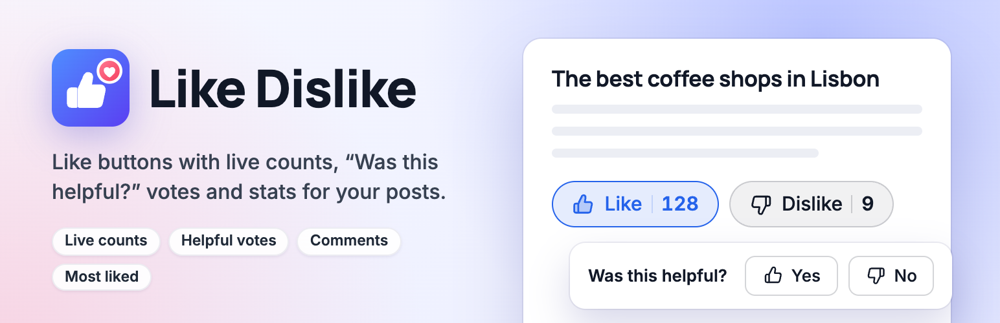
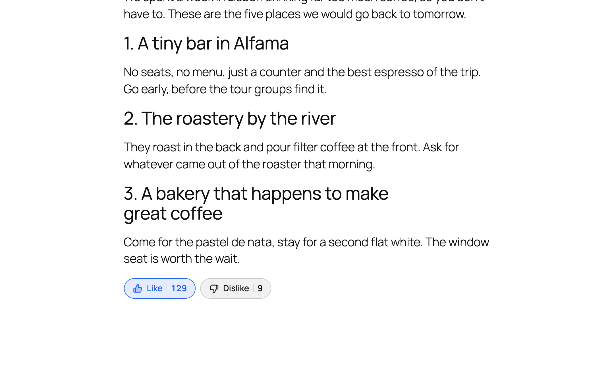

# Like Dislike

[](https://wordpress.org/plugins/like-dislike-for-wp/)
[](https://wordpress.org/plugins/like-dislike-for-wp/)
[](https://wordpress.org/support/plugin/like-dislike-for-wp/reviews/)
[](https://wordpress.org/plugins/like-dislike-for-wp/)
[](https://github.com/wpankit/like-dislike-for-wp/actions/workflows/coding-standards.yml)
[](https://github.com/wpankit/like-dislike-for-wp/actions/workflows/plugin-check.yml)
[](LICENSE)



Like and dislike buttons with live counts for posts, pages, products and comments, a "Was this helpful?" mode, most liked posts, and stats. Readers vote with one click, see the counts change straight away, and can change their mind.

**[Get it on WordPress.org](https://wordpress.org/plugins/like-dislike-for-wp/)** · [Support forum](https://wordpress.org/support/plugin/like-dislike-for-wp/)



## Features

- **Buttons that just work:** live counts, one vote per person, switch or take back a vote, and voting that keeps working on cached pages. A tiny script without jQuery, loaded only where the buttons are.
- **Make them yours:** five icon sets, three styles and sizes, your own colours and labels, and presets, with a live preview in Settings.
- **"Was this helpful?":** ask a question, thank readers, and ask what could be better when someone says no.
- **Likes on comments**, and the **Most Liked Posts** block and `[most_liked_posts]` shortcode.
- **Stats:** votes over time, most liked and disliked posts, readers' feedback, and a sortable Likes column.
- **Private by design:** IP addresses are never stored, only a keyed one-way hash, and there are no requests to outside services.

Everything in Like Dislike is free, and what's free stays free.

## Requirements

- WordPress 6.0 or later
- PHP 7.4 or later

## Development

Clone the repository into a WordPress site's plugins folder as `like-dislike-for-wp`, and install the coding standards tools:

```bash
cd wp-content/plugins
git clone https://github.com/wpankit/like-dislike-for-wp.git
cd like-dislike-for-wp
composer install
```

There is no build step: the JavaScript and CSS in `assets/` are loaded as they are.

| Command | What it does |
|---|---|
| `composer lint` | Checks the code against the WordPress Coding Standards and PHP 7.4+ compatibility, using `phpcs.xml.dist`. |
| `composer format` | Fixes the issues that can be fixed automatically. |

### Project layout

| Path | Contents |
|---|---|
| `like-dislike-for-wp.php` | Plugin header, constants and bootstrap |
| `includes/` | Votes, the REST API (`like-dislike-for-wp/v1`), the buttons, blocks and shortcodes, settings, stats, admin screens, privacy tools and upgrades |
| `assets/` | The buttons script and styles, the Settings preview, and the blocks |
| `languages/` | The translation template |
| `.wordpress-org/` | Icon, banners and screenshots for the WordPress.org listing |
| `tools/wporg-assets/` | The script and demo content that build those images |

Development files are marked `export-ignore` in `.gitattributes`, so they never reach the plugin zip.

### Checks on every pull request

- **Coding Standards:** PHPCS with the WordPress Coding Standards and PHPCompatibilityWP.
- **PHP Lint:** every PHP file must parse on PHP 7.4 through 8.5.
- **Plugin Check:** the official WordPress.org Plugin Check, run on the plugin as it ships.

## Releasing

For maintainers:

1. In a pull request, set the new version in the plugin header, in `LDFW_VERSION` and in the `Stable tag` of `README.txt`, and add the changelog entry.
2. Merge it, then [publish a release](https://github.com/wpankit/like-dislike-for-wp/releases/new) from `main` with the tag `vX.Y.Z`.
3. The **Deploy to WordPress.org** workflow checks the three version numbers match the tag, commits `trunk` and `tags/X.Y.Z` to SVN, updates the listing assets and attaches the plugin zip to the release.

To publish readme or screenshot changes without a release, run the **Update readme and assets on WordPress.org** workflow by hand. Both workflows need the repository secrets `SVN_USERNAME` and `SVN_PASSWORD`.

## Contributing

Bug reports, ideas and pull requests are welcome. Please read [CONTRIBUTING.md](CONTRIBUTING.md) first; everyone taking part follows the [Code of Conduct](CODE_OF_CONDUCT.md).

## Security

Please report security issues privately, as described in [SECURITY.md](SECURITY.md).

## License

[GPL-2.0-or-later](LICENSE). Made by [WPAnkit](https://wpankit.com/).
